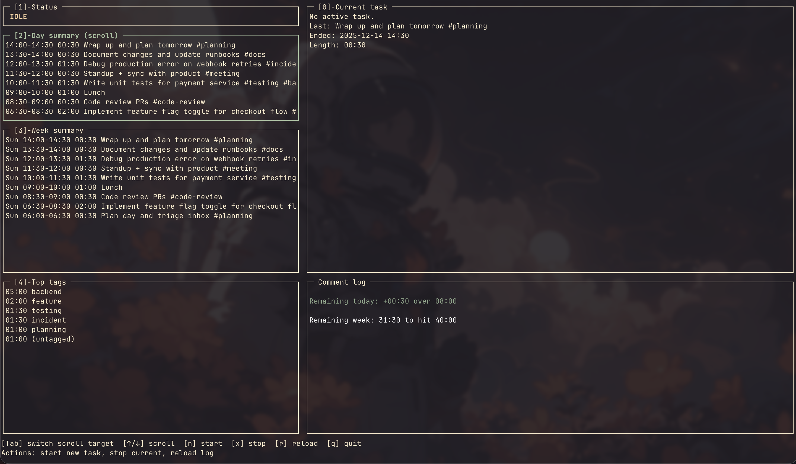

# pytimelog

Minimal CLI time logger inspired by gtimelog. Stores entries in a single text file (default `~/.pytimelog/log.txt`) using UTC timestamps and summarizes time by tags.

## Quickstart

```bash
pip install .  # or: python -m pip install -e .
pytimelog start "Write docs #project"
pytimelog status
pytimelog stop
pytimelog report             # today's totals
pytimelog report --from 2024-01-01 --to 2024-01-07
```

## Commands

- `start <text> [--at TIME]` — begin an active entry; `TIME` is ISO or `HH:MM` local, default now.
- `stop [--at TIME]` — stop the active entry.
- `add --start TIME --end TIME <text>` — add a finished entry retroactively; rejects overlaps.
- `status` — show the current running entry, if any.
- `report [--from DATE] [--to DATE] [--week|--last-week]` — totals by tag for a date or range (local dates, UTC storage), with shortcuts for this or last week.
- `ui` — open a small Tk window to start/stop and view today's entries.
- `tui` — open a curses terminal UI with lazygit-like panes and shortcuts.

Tags are parsed from `#tag` words in the text. Entries without tags roll up under `(untagged)`.

## UI mode

The `ui` command launches a simple window similar to gtimelog: type what you're doing and click **Start**, click **Stop** to finish, and see today's entries listed with durations. It uses the same log file as the CLI. Requires Tk (bundled with most Python installs).

## Terminal UI

Run `pytimelog tui` for a split-pane terminal view (inspired by lazygit) that shows today's or this week's entries, highlights the running entry, and lets you start/stop without leaving the keyboard.

- `↑/↓` or `k/j` scroll the day/week panes (see footer for active target)
- `Tab` switches scroll focus between day and week panes
- `n` starts a new entry (prompts for text)
  - Include `@HH:MM` to backdate the start time for today
  - Include two times `@HH:MM @HH:MM` to add a completed entry immediately (start/end) without leaving one running
- `x` stops the running entry
- `r` reloads the log file
- `q` quits

## Tagging details

- Tags are any words starting with `#` in the entry text: `Write docs #project #writing`.
- Multiple tags are allowed; time is counted toward each tag independently.
- If no tags are present, the time is grouped under `(untagged)`.
- Reports summarize by tag; tags are case-insensitive for sorting but keep their original spelling in output.


